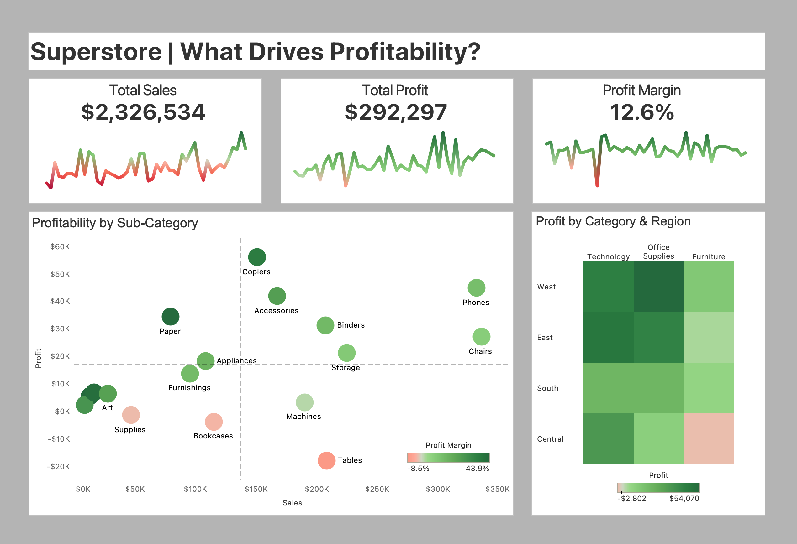

# What Drives Profitability? (Tableau Dashboard)

---

## Overview
Interactive Tableau dashboard analyzing key drivers of profitability across product categories, sub-categories, and regions using the Superstore dataset.

---

## Business Question
What factors drive profitability, and why do some high-sales products generate low or negative profit?

---

## Dashboard Preview

---

## Key Findings
- High sales does not always translate to high profit (e.g., Tables)
- Technology drives the majority of profit across regions
- Regional performance varies significantly, especially in Furniture

---

## Tools Used
- Tableau (data visualization)
- Calculated fields (profit margin, aggregations)
- Superstore Dataset

---

## Live Dashboard
[View on Tableau Public](https://public.tableau.com/app/profile/hunter.heller/viz/WhatDrivesProfitabilitySuperstoreAnalysis/WhatDrivesProfitabilitySuperstoreAnalysis)
